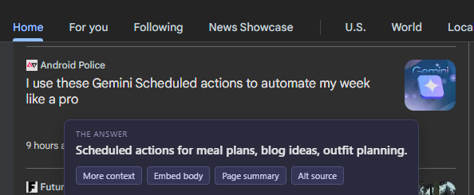
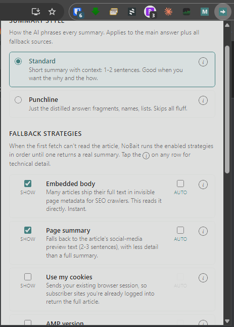

NoBait v2 resolves link redirects and answers clickbait headlines on mousedown, without leaving the page.

## What It Does

Hold any link for 500ms. The extension intercepts the mousedown event, resolves the full redirect chain, fetches the destination article, and shows the headline's plain-English answer in a floating tooltip. Redirect resolution uses fetch (HEAD then GET) with a Google News RSS shortcut for CBM URLs — no AI or proxy at that step. When the primary fetch is blocked or paywalled, a configurable fallback chain retries via embedded article metadata, browser cookies, AMP URLs, alternative publisher coverage, or a Wayback Machine snapshot.

## Screenshots

Long-press tooltip with the AI answer and fallback action buttons.

Settings panel with summary style and fallback strategy toggles.

## Stack

- Chrome and Firefox, Manifest V3
- JavaScript: service worker, content script
- OpenAI gpt-4o-mini via Cloudflare Worker proxy
- Chrome APIs: tabs, storage, fetch with redirect following

## How It Works

- On 500ms mousedown hold, resolves the redirect chain via HEAD/GET fetch or Google News RSS; falls back to a background tab for JS-only redirectors
- Extracts article text from JSON-LD schema (`articleBody`), `og:description` meta tags, or raw HTML
- Sends text to a Cloudflare Worker that calls OpenAI and returns a trimmed summary (220 chars standard, 100 chars punchline mode)
- Fallback chain runs in order: JSON-LD body, meta description, browser cookies, AMP version, 12ft.io proxy, alternative source search, Wayback Machine snapshot
- Fallback visibility and auto-run behavior are individually configurable in the settings panel

## Setup

1. Clone the repo
2. Open `chrome://extensions`
3. Enable Developer mode
4. Click Load unpacked and select the repo folder
5. Hold any link for 500ms to trigger the tooltip

## Relevance

Demonstrates redirect chain resolution, content extraction heuristics, and a tiered fallback pipeline inside a Manifest V3 service worker with no persistent background process.
